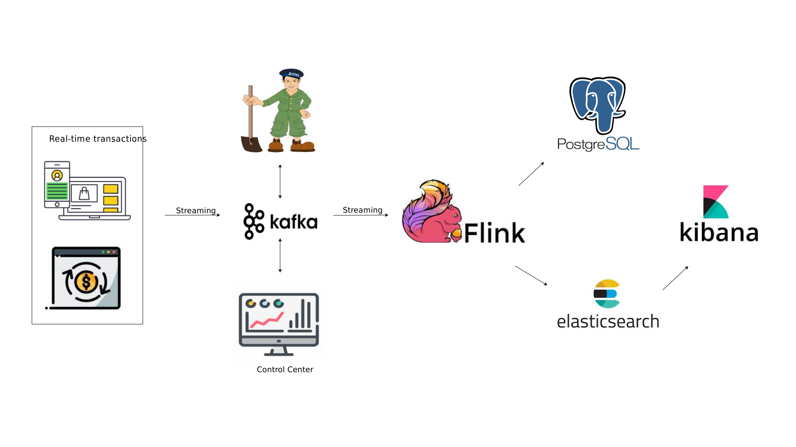
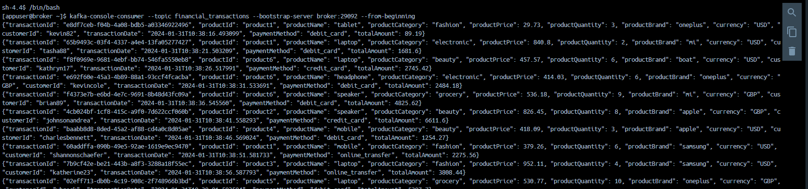
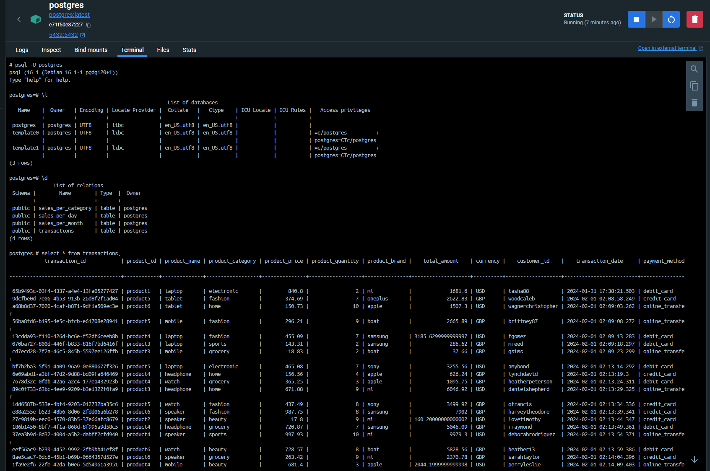
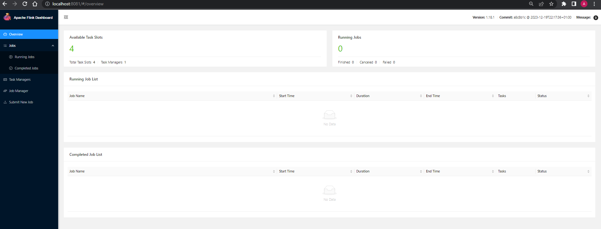
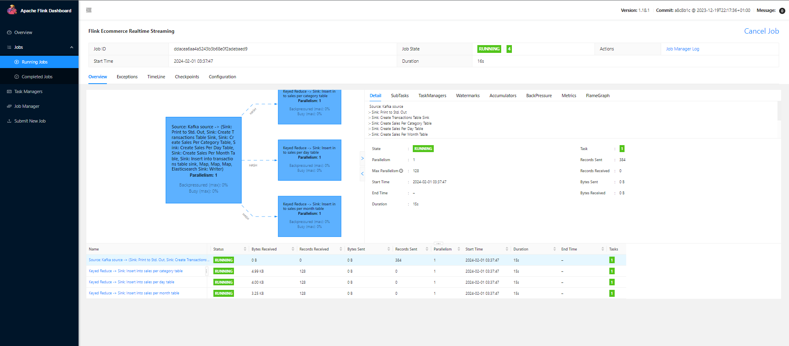
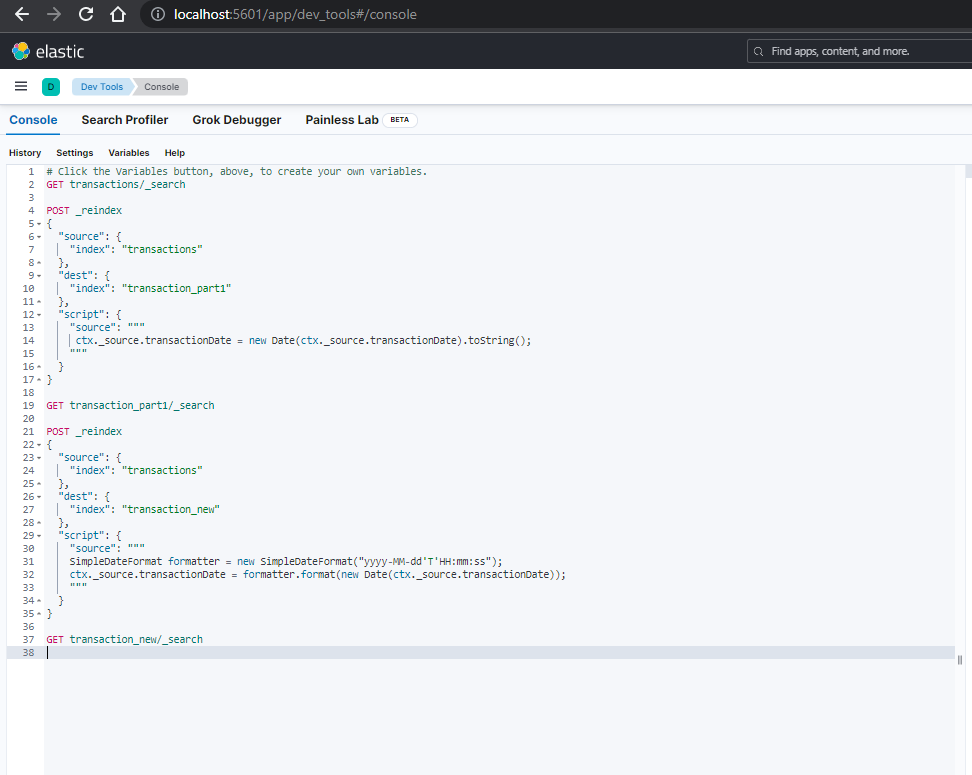
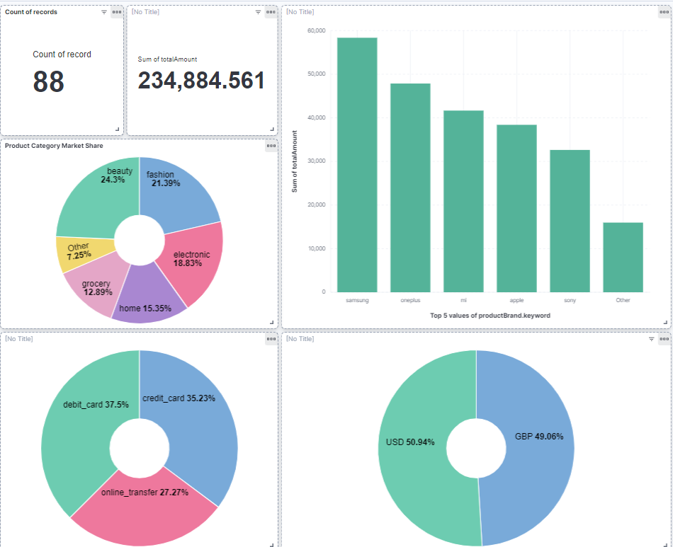

# Real-Time Data Processing and Analytics with Apache Flink, Kafka, Elasticsearch, and Docker

* [Overview](#overview) 🌐
* [System Architecture](#system-architecture) 🏛️
* [Prerequisites](#prerequisites) 🛠️
* [Installation](#installation) 🚀
* [Docker Services](#docker-services) 🐳
    * [Kafka Broker](#kafka-broker) 🚀
    * [Postgres](#postgres) 🐘
    * [Flink](#flink)
    * [ElasticSearch and Kibana](#ELKstack)
* [Getting Started](#getting-started) 🚦
* [Customization](#customization) 🛠️
* 📚 [References](#references) 📖
* 📧 [Contact](#contact) 📬


## Overview
This project guides you through building an end-to-end data engineering system using Apache Flink, Kafka, Elasticsearch, Kibana, and Docker. The system processes real-time data and generates analytics, demonstrating the power of these technologies in an industry-grade data pipeline.

## System Architecture


## Prerequisites
Before running this project, ensure you have the following installed:

* [JDK 17](https://www.oracle.com/java/technologies/downloads/#java17)
* [Apache Flink](https://flink.apache.org/downloads/)
* [Kafka architecture](https://docs.confluent.io/platform/current/connect/index.html)
* [Docker](https://docs.confluent.io/platform/current/connect/index.html)

## Installation
### Clone the Repository
Clone this repository to your local machine:

```
git clone <repository-url>
cd <repository-folder>
```

### Install Dependencies
Install the required dependencies using Maven:

```
mvn clean install
```

### Docker Services
Use Docker Compose to set up the required services:

```
docker-compose up -d
```

This command will download necessary Docker images, create containers, and start services in detached mode.

### Verify Services
Check if all services are up and running:

```
docker-compose ps
```
You should see all services listed as 'running'.


#### Kafka Broker 🚀
After you streaming data via Python faker script to Kafka, check the availbility in broker terminal with the file in the path ./script/check-availibility-messages.txt


#### Postgres 🐘
Checking data streaming to Postgre via Flink


#### Flink 
Access Flink web page for running and monitoring jobs:




#### ElasticSearch and Kibana
Indexing transactions and create Realtime dashboard
Accessing Elasticsearch and indexing the data in ElasticSearch to change the date format for visualizing



### Accessing the Services
Elasticsearch: Default port 9200
Kibana: Default port 5601

### Usage 🚀
Ensure all Docker containers are up and running. Run the FlinkCommerce application provided in this repository to perform real-time analytics on financial transactions.

### Application Details 📊
The DataStreamJob class within the FlinkCommerce package serves as the main entry point for the Flink application. The application:

- Consumes financial transaction data from Kafka.
- Performs various transformations.
- Stores aggregated results in both Postgres and Elasticsearch.

### Components 🛠️
Apache Flink:
Sets up the Flink execution environment.
Connects to Kafka as a source for financial transaction data.
Processes, transforms, and performs aggregations on transaction data streams.

Postgres:
Stores transaction data and aggregated results in tables (transactions, sales_per_category, sales_per_day, sales_per_month).

Elasticsearch:
Stores transaction data for further analysis.

### Code Structure  📁
DataStreamJob.java: Contains the Flink application logic, including Kafka source setup, stream processing, transformations, and sinks for Postgres and Elasticsearch.
Deserializer, Dto, and utils packages: Include necessary classes and utilities for deserialization, data transfer objects, and JSON conversion.

### Configuration ⚙️
Kafka settings: Configured within the Kafka source setup (bootstrap servers, topic, group ID).
Postgres connection details: Defined in the jdbcUrl, username, and password variables.

### Sink Operations 🚢
The application includes sink operations for Postgres using JDBC to:

Create tables (transactions, sales_per_category, sales_per_day, sales_per_month).
Perform insert/update operations.

### Shutting Down
To stop and remove containers, networks, and volumes:

```
docker-compose down
```

## Getting Started
Follow the video tutorial for a step-by-step guide on building and running the project.

## Customization
You can modify the Docker Compose file to suit your needs. For example, consider additional configurations for production environments.

⚠️ Note: This setup is intended for development and testing purposes. For production environments, consider additional factors like security, scalability, and data persistence.

## References
Apache Flink Documentation
Elasticsearch Documentation
Docker Documentation
- [Kafka Documentation](https://kafka.apache.org/documentation/)
- [Python Faker](https://faker.readthedocs.io/en/master/)
- [Inspired by a tutorial on real-time data processing.](https://www.youtube.com/watch?v=deepQRXnniM&t=384s)

## 📧Contact
Please feel free to contact me if you have any questions.
<a href="https://ducanh0285@gmail.com" target="blank"></a><a href="https://www.facebook.com/ducanh.pp" target="blank"></a><a href="https://twitter.com/Ducann02Nguyen" target="blank"></a><a href="https://www.linkedin.com/in/ducanhnt/" target="blank"></a>
